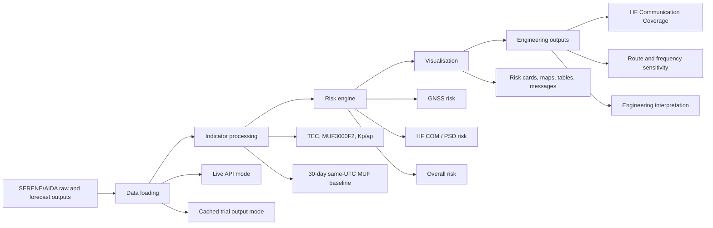

# Aviation Space Weather Dashboard Based on SERENE AIDA Data

This repository contains a Streamlit research prototype that converts SERENE
AIDA ionospheric model outputs into aviation-oriented space weather risk
information.

The main app is in `streamlit_cloud_github/app.py`.

## Aim

Convert SERENE AIDA scientific outputs into aviation-oriented risk information,
including GNSS and HF communication risk categories, maps, summary tables, and
TEST SPWX research messages.

## Main Features

- SERENE AIDA TEC and MUF3000F2 loading
- Kp/ap geomagnetic context
- GNSS risk from Vertical TEC
- HF COM risk from Post-Storm Depression
- Four evidence-first status cards: GNSS, HF COM, Overall, and Data Completeness
- Full requested/actual/retrieved UTC provenance and official forecast count
- Standalone HF communication study: UK to North Atlantic to New York JFK
- Standalone frequency sensitivity comparison for 5 to 20 MHz
- Named HF route scenarios and searchable city-to-city endpoint selection
- ICAO/PECASUS-style summary table
- Categorical risk maps
- TEST SPWX research messages
- Global default grid for aviation-scale awareness
- Cached trial outputs for faster demonstration
- Live SERENE API mode for new analysis times

## Architecture and Workflow

The project is designed as an Engineering Decision Support prototype rather
than a simple risk display. The dashboard translates SERENE/AIDA scientific
outputs into aviation-oriented indicators, then into HF communication impact
and decision-support interpretation.



The engineering chain is:

```text
Risk Assessment
  -> Communication Impact
  -> Engineering Interpretation
  -> Decision Support
```

Key code modules:

- `streamlit_cloud_github/app.py` is the Streamlit application shell and page
  orchestration layer.
- `streamlit_cloud_github/data_loader.py` loads Live SERENE API data, cached
  trial outputs, and global Kp/ap context.
- `streamlit_cloud_github/icao_risk.py` converts supported indicators into
  prototype GNSS, HF COM, and overall risk categories.
- `streamlit_cloud_github/icao_message.py` builds TEST research messages from
  the risk outputs.
- `streamlit_cloud_github/hf_coverage.py` contains the HF communication impact
  calculations, `HFPropagationEngine`, route metrics, and frequency comparison
  logic. Mode A is the current MUF-threshold engineering approximation; Mode B
  is reserved for a future validated ray-tracing backend.
- `streamlit_cloud_github/hf_coverage_ui.py` renders the HF engineering case
  study in Streamlit while keeping the calculation logic separate.
- `streamlit_cloud_github/validation_ui.py` renders validation assumptions,
  historical replay checks, sensitivity checks, and current limitations.
- `streamlit_cloud_github/icao_visualisation.py` and
  `streamlit_cloud_github/visualisation.py` create the map and chart views.

The HF engineering module keeps the existing MUF-threshold proxy and labels it
as **Engineering Impact: HF Communication Coverage**. It reports quiet coverage,
storm coverage, coverage loss, quiet/storm route availability, degraded route
percentage, unavailable route percentage, longest degraded route segment, and a
concise interpretation. Frequency comparison can identify the model-preferred
storm frequency inside the MUF-threshold approximation, but it is labelled as
research decision support and must not be used as operational frequency advice.

## Evidence-first status rules

Risk severity and evidence completeness are reported separately. `OK` is shown
as the overall result only when all required component evidence is available and
OK. If GNSS is OK while HF evidence is unavailable, the dashboard reports
`PARTIAL DATA`; if a MODERATE or SEVERE result exists alongside missing inputs,
it preserves that severity and adds a `PARTIAL DATA` qualifier. The completeness
panel exposes the available/required count, percentage, and missing indicators.

The first screen also shows the requested analysis time, actual AIDA output
time, retrieval time, data age, and number of official forecast products. The
detailed HF coverage/route work is presented as a collapsed standalone study,
not as an integrated operational warning product.

The standalone study defaults to the illustrative `Birmingham → New York`
scenario. Users can select other representative routes, choose two named cities
or regions from an offline catalogue, or open Advanced coordinates for exact
latitude/longitude reproduction. These are assumed communication endpoints;
they are not verified HF ground stations, airport pairs, or aircraft tracks.

## Validation Approach

Validation is organised around the engineering decision-support workflow:

- Historical event replay using cached trial outputs or Live SERENE API mode.
- Quiet vs storm comparison using AIDA `reference_value` when the 30-day
  same-UTC MUF3000F2 baseline is available.
- PSD sensitivity using the fallback PSD slider only when historical comparison
  data is unavailable.
- Frequency sensitivity across 5, 7.5, 10, 12.5, 15, 17.5 and 20 MHz.
- Route assessment verification for the UK transmitter to North Atlantic to New
  York JFK case study.

The Trace feasibility work is documented in `docs/Trace_Integration_Report.md`.
The dashboard does not fake ray tracing; current HF coverage remains a
MUF-threshold engineering proxy until validated electron-density profiles are
available for Trace.

Dissertation and presentation evidence is summarised in
`docs/engineering_review.md`, including the architecture diagram, workflow
diagram, validation summary, limitations, future work, and suggested wording.

## Limitations

- Research prototype only
- Not for operational aviation use
- Near-real-time monitoring uses the latest safely published AIDA state, not a
  zero-latency operational feed. The safe analysis anchor is current UTC minus
  15 minutes, floored to the five-minute AIDA cadence.
- Automatic refresh is optional and is restricted to **Live SERENE API** +
  **Quick Demo** + **Follow latest near-real-time**. Full ICAO-style mode is
  manual-only because it can load 37 rolling states, up to 30 baseline states,
  and three forecasts in one refresh.
- No direct radiation dose product
- No S4 / sigma-phi scintillation input from SERENE-only data
- No direct PCA / SWF product from SERENE-only data
- Forecasts may be official SERENE forecasts or clearly labelled
  dashboard-generated fallback predictions
- Kp/ap-dependent PSD and HF COM products remain unavailable when the required
  official 96-hour history is incomplete; they are never replaced with
  fabricated values. In an official CSV check on 2026-08-10, the latest source
  timestamp observed was `2026-07-07T03:00:00Z`.

## Near-real-time operation and verification

**Follow latest near-real-time** is enabled by default for a new session. It
derives the date and time from the safe analysis anchor; switching it off
restores manual historical selection. **Load / Refresh data** remains
available in both modes. When following latest it recalculates the safe anchor
before loading; in historical mode it uses the selected analysis time unchanged.

**Auto-refresh every 15 minutes** is disabled by default. It is available only
for **Live SERENE API**, **Quick Demo**, and **Follow latest near-real-time**.
The scheduler reloads only when the safe five-minute anchor changes. This keeps
the larger Full ICAO-style request set manual and prevents repeated downloads.

Forecast API requests are anchored to the analysis time: `file_time` is the
selected analysis time and `period` is the requested horizon. The displayed
valid time is calculated locally as `analysis time + period`. This corrects the
previous future-`file_time` request for current-day analysis. Browser results
from 2026-08-07 to 2026-08-10 are pre-fix observations, not proof of the new
deployment; the deployed app still requires live acceptance testing. See
[`docs/near_real_time_verification_2026-08-10.md`](docs/near_real_time_verification_2026-08-10.md)
for the evidence table and acceptance checklist.

## Cached Trial Outputs

Cached processed outputs for selected demo / validation periods can be stored in
`streamlit_cloud_github/data/trial_outputs/`. These files are intended to speed
up presentation and validation without repeating every SERENE download.

Live SERENE API loading remains available for new analysis times. Cached output
files must not contain API tokens, Streamlit secrets, raw credentials, or
personal data.
