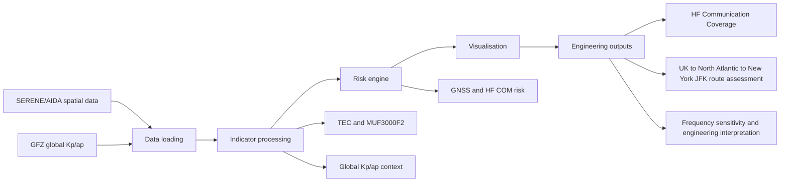

# Aviation Space Weather Dashboard Based on SERENE AIDA Data

Streamlit dissertation prototype using authenticated SERENE AIDA ionospheric
model outputs. It creates transparent, rule-based GNSS/HF risk indications from
spatial ionospheric parameters.

> Academic prototype only. It is not an official ICAO advisory system and must
> not be used for operational aviation decisions.

## Correct API data flow

```text
Streamlit Secrets
  -> GET https://spaceweather.bham.ac.uk/api/download-output/
  -> GET https://spaceweather.bham.ac.uk/api/download-forecast/ when available
  -> one raw AIDA HDF5 state per distinct requested time
  -> official AIDAState.readFile() and AIDAState.calc()
  -> exact local bounding-box/grid calculation
  -> time, lat, lon, variable, value, model DataFrame
GFZ public HTTPS nowcast (no token)
  -> three-hourly global Kp/ap for the preceding 96-hour gate
  -> ICAO-style category maps, summary table and research text messages
```

## Engineering decision-support workflow

The final project workflow is:



The dashboard does not stop at risk categories. The intended chain is:

```text
Risk Assessment
  -> Communication Impact
  -> Engineering Interpretation
  -> Decision Support
```

Changing the map extent or spacing changes only local calculation and plotting.
It does not create one API request per point. Identical time/latency requests
are deduplicated.

The default grid is global, using latitude -90 to 90, longitude -180 to 180, and
a 15 degree grid step for aviation-scale awareness. Users can still choose a
smaller regional bounding box and finer grid step for regional analysis.

## Upstream scientific implementation

Raw-state interpretation and scientific grid calculation use Benjamin Reid's
MIT-licensed [`breid-phys/aida-ionosphere`](https://github.com/breid-phys/aida-ionosphere)
package, pinned to `v0.1.3`. The authenticated request follows its official
[`downloadOutput` implementation](https://github.com/breid-phys/aida-ionosphere/blob/v0.1.3/aida/api.py).
Nearby source comments identify every boundary that relies on this contract;
the dashboard does not copy the upstream scientific model implementation.

Supported spatial fields are `TEC`, `foF2`, `MUF3000F2` (upstream
`MUF3000`), `NmF2`, and `hmF2`. Kp/ap are global planetary indices and are
shown only as global context, never as regional map cells.

### Global geomagnetic source

Only Kp/ap are loaded directly from the public GFZ Helmholtz Centre for
Geosciences [`Kp_ap_nowcast.txt`](https://kp.gfz.de/fileadmin/files_for_gfz_cms/Kp_ap_nowcast.txt).
It requires no API token and supplies three-hourly Kp and ap values for the
latest 30 days. The dashboard exposes whether each value is `preliminary`
(`D=0`) or `definitive` (`D=1`), and never converts a missing or incomplete
96-hour Kp history to `OK`. SERENE remains the source for every AIDA observation
and forecast.

The GFZ file is licensed CC BY 4.0 and requests citation of Matzka et al.,
“The geomagnetic Kp index and derived indices of geomagnetic activity,”
*Space Weather* (2021), [doi:10.1029/2020SW002641](https://doi.org/10.1029/2020SW002641),
and the GFZ Kp dataset,
[doi:10.5880/Kp.0001](https://doi.org/10.5880/Kp.0001).

## ICAO-style products with traceable sources

The primary dashboard uses three research categories: `OK`, `MODERATE`, and
`SEVERE`. Vertical TEC uses the ICAO 125/175 TECU thresholds. The Kp auroral
absorption proxy uses Kp 8/9 and remains global. Post-storm depression uses
30%/50%, a same-UTC 30-day AIDA median, and the requirement that GFZ Kp
reached 6 during the preceding 96 hours.

`Max 3h` loads 37 five-minute AIDA analysis states. Each distinct time is
downloaded once; all regional grid cells are calculated locally.

The primary forecast display contains +30 min and +90 min prediction outputs
only when their official SERENE AIDA HDF5 files were retrieved and decoded for
the selected analysis cycle. The loader also checks +3 h and +6 h so their
availability remains auditable, but those longer horizons do not become risk
columns, map choices, charts, or message fields. Missing upstream data are never
interpreted as `OK`.

SERENE AIDA does not currently provide amplitude scintillation S4, phase
scintillation sigma-phi, 30 MHz riometer PCA, or solar-X-ray SWF inputs. The UI
omits those unsupported products rather than displaying placeholder risk rows
or fabricating zero or `OK`.

Generated SWX text is deterministic and explicitly marked `STATUS: TEST` and
`RESEARCH PROTOTYPE - NOT FOR OPERATIONAL USE`.

### Evidence-first first screen

The first screen separates risk severity from evidence quality. It contains
four cards: GNSS Risk, HF COM Risk, Overall Risk, and Data Completeness. Missing
inputs cannot silently produce overall OK: GNSS OK plus HF unavailable becomes
`PARTIAL DATA`, while MODERATE or SEVERE is preserved with a partial-data
qualifier. The completeness section shows the exact available/required count,
percentage, and missing indicators.

A full-width provenance strip displays requested analysis time, actual returned
AIDA time, retrieval time, data age, and the number of official forecast
horizons. A successful live AIDA load is itself connection evidence, so the UI
does not simultaneously describe the API as untested.

## Standalone HF propagation case study

The dashboard retains a collapsed entry to a standalone engineering HF
propagation case study inspired by
the [Trace HF ray-tracing toolkit](https://pytrace.readthedocs.io/en/latest/).
It does not run full Trace ray tracing in the current prototype. Instead, it
uses MUF3000F2 to build a route-level HF communication proxy. Where AIDA
30-day same-UTC `reference_value` data is available, the section compares a
quiet/background MUF state with the storm/current MUF state. If that reference
is missing, it falls back to a clearly labelled assumed Post-Storm Depression
demonstration.

This standalone section is intended to make the communication impact of PSD easier to
explain in the MSc project presentation. The user can select a UK transmitter,
a North Atlantic or custom target, a route frequency, and a local grid
resolution. The app samples MUF along a great-circle route, reports quiet and
storm route availability, highlights the longest degraded route segment, and
runs a small frequency sweep to identify a potentially more robust frequency
for this research case.

The calculation is exposed through `HFPropagationEngine`. Current Mode A uses
the MUF-threshold engineering approximation. Future Mode B is reserved for a
validated ray-tracing backend, but it is intentionally not implemented until an
AIDA-to-ray-tracing electron-density conversion has been verified. The
frequency recommendation is therefore model-based decision support inside the
current approximation, not operational frequency advice.

Coverage categories are limited to the supported MUF proxy:

- `Usable in both`
- `Degraded during storm`
- `Unusable in both`
- `Improved during storm`

The route and transmitter are illustrative, so the output remains a research
demonstration rather than an operational HF coverage product. The Trace
integration status is documented in `../docs/Trace_Integration_Report.md`; the
optional `trace_poc_probe.py` script only checks local Trace readiness and does
not generate ray paths.

### Route setup

The beginner-facing route controls provide:

- **Preset scenario**, defaulting to Birmingham → New York;
- **Custom city-to-city**, using searchable named locations; and
- **Advanced coordinates**, retaining exact manual latitude/longitude inputs.

The version-controlled offline catalogue includes representative UK, North
Atlantic and long-haul locations. It avoids external geocoding availability,
rate-limit, privacy and ambiguity problems. The resolved names and coordinates
are shown before analysis. Selected locations are assumed geographic
communication endpoints, not confirmed HF transmitter sites or validated
aircraft trajectories.

## Cached trial outputs

Selected demo / validation periods can be loaded from cached processed outputs
stored in `data/trial_outputs/`. This speeds up presentations and validation by
avoiding repeated SERENE downloads for known trial periods.

The app starts with **Cached trial output** as the loading mode. If a matching
cache folder does not exist, it falls back to **Live SERENE API** and shows a
warning. Live SERENE API mode is still available for new analysis times.

Cached outputs are research demonstration artifacts only. They must contain
processed products, indices, summary tables, and status metadata only; never
store SERENE API tokens, Streamlit secrets, raw credentials, or personal data.

To generate cache folders locally with a valid SERENE API token:

```bash
python streamlit_cloud_github/generate_trial_outputs.py --mode "Quick Demo"
```

For the slower full research product, use:

```bash
python streamlit_cloud_github/generate_trial_outputs.py --mode "Full ICAO-style mode"
```

Streamlit Cloud runtime writes are temporary. Generate cached outputs locally,
review the files under `streamlit_cloud_github/data/trial_outputs/`, then commit
them to GitHub.

If Live SERENE API loading succeeds in Streamlit Cloud, use the dashboard's
**Download cached trial output ZIP** button, then extract the ZIP so the
`<cache_key>/` folder sits under `streamlit_cloud_github/data/trial_outputs/`
before committing.

## Streamlit Community Cloud deployment

The upstream package requires `pandas<2` and `numpy<2`. Deploy with **Python
3.11**. Streamlit Community Cloud cannot change an existing app's Python version
in place, so preserve the URL and Secrets, delete the existing app, then deploy
it again and select Python 3.11 under **Advanced settings**. See the
[official Streamlit instructions](https://docs.streamlit.io/deploy/streamlit-community-cloud/manage-your-app/upgrade-python).

Use `streamlit_cloud_github/app.py` as the entrypoint and configure:

```toml
SERENE_API_BASE_URL = "https://spaceweather.bham.ac.uk"
# Add SERENE_API_TOKEN and its private value directly in Streamlit Secrets.
SERENE_API_TIMEOUT = "30"
SERENE_AUTH_SCHEME = "Token"
SERENE_AIDA_ARCHIVE_START = "2024-09-28T00:00:00Z"
```

Any token pasted into chat, screenshots, commits, or public files must be
revoked. Never reuse the previously exposed token.

## Verification

After deployment:

1. Click **Test SERENE API connection** and expect `Connected to SERENE AIDA raw-output API`.
2. Load a small region and confirm AIDA maps appear.
3. Confirm the primary table contains Latest, historical Max 3h, and the
   successfully retrieved official +30 min/+90 min columns.
4. Open the forecast audit and confirm +3 h/+6 h are evidence rows only.
5. Confirm the categorical map uses only OK/MODERATE/SEVERE (plus grey
   unavailable cells).
6. Compare 30-degree and 2-degree grids for the same analysis time. The number
   of time-product API requests must not change.
7. Confirm Kp/ap appear only in the global geomagnetic panel.

Local automated tests:

```bash
python -m unittest discover -s tests -v
```

No local scientific sample dataset is used as a silent fallback.

## Near-real-time monitoring and safe refresh

This is an on-demand or optionally scheduled **near-real-time** research
monitoring prototype, not a zero-latency operational service. In follow-latest
mode the dashboard downloads the newest Ultra state, reads the authoritative
cycle time stored inside that HDF5 file, and uses that exact cycle as forecast
`file_time`. The data-status panel records the requested analysis time, returned
AIDA time, data age, and refresh status.

**Follow latest near-real-time** is enabled for new sessions. Turn it off to
choose an historical analysis time manually. **Load / Refresh data** always
remains available; manual selections still default to a conservative time.

**Auto-refresh every 15 minutes** is off by default and is permitted only when
all of these are selected: **Live SERENE API**, **Quick Demo**, and **Follow
latest near-real-time**. The scheduled refresh only loads a changed safe anchor.
**Full ICAO-style mode remains manual-only** because a load can request 37
rolling states, up to 30 baseline states, and four forecast availability checks.

For official forecast requests, `file_time` is the analysis time and `period`
is the horizon; the dashboard derives valid time as `analysis time + period`.
This avoids sending a current-day future `file_time` to SERENE. A failed
forecast does not discard a successful observation. Browser tests from
2026-08-07 through 2026-08-10 were pre-fix observations; re-test a newly
deployed app before treating the correction as live-accepted.

Authenticated evidence checks on 2026-08-12 confirmed that availability is
cycle-dependent. Earlier tested Ultra and Rapid cycles returned official
+30 min/+90 min HDF5 outputs while +3 h/+6 h returned HTTP 404; the later
Ultra state at 10:55 UTC returned all four horizons. The dashboard therefore
validates every request dynamically and retains its outcome in the forecast
audit. The primary decision surface remains deliberately limited to the
verified +30 min/+90 min scope.

The former SERENE-distributed Kp/ap CSV was observed to stop at
`2026-07-07T03:00:00Z`. The implemented Kp/ap path now reads the original
public GFZ nowcast file directly. It checks the selected preceding 96 hours and
retains GFZ preliminary/definitive provenance. If that history is incomplete,
Kp/ap-dependent PSD remains unavailable. The optional HF slider is an
explicitly labelled assumed PSD demonstration, never live scientific data.

See [`../docs/near_real_time_verification_2026-08-10.md`](../docs/near_real_time_verification_2026-08-10.md)
for browser observations and the required live deployment acceptance test.

## Main features

- SERENE AIDA TEC and MUF3000F2 loading
- Direct public GFZ Kp/ap geomagnetic context
- GNSS risk from Vertical TEC
- HF COM risk from Post-Storm Depression
- HF propagation case study for PSD-driven communication degradation
- ICAO/PECASUS-style summary table
- Categorical risk maps
- TEST SPWX research messages
- Global default grid
- Cached trial outputs for faster demonstration
- Live SERENE API mode

## Limitations

- Research prototype only
- Not for operational aviation use
- No direct radiation dose product
- No S4 / sigma-phi scintillation input from SERENE-only data
- No direct PCA / SWF product from SERENE-only data
- Forecasts may be official SERENE forecasts or clearly labelled
  dashboard-generated fallback predictions
